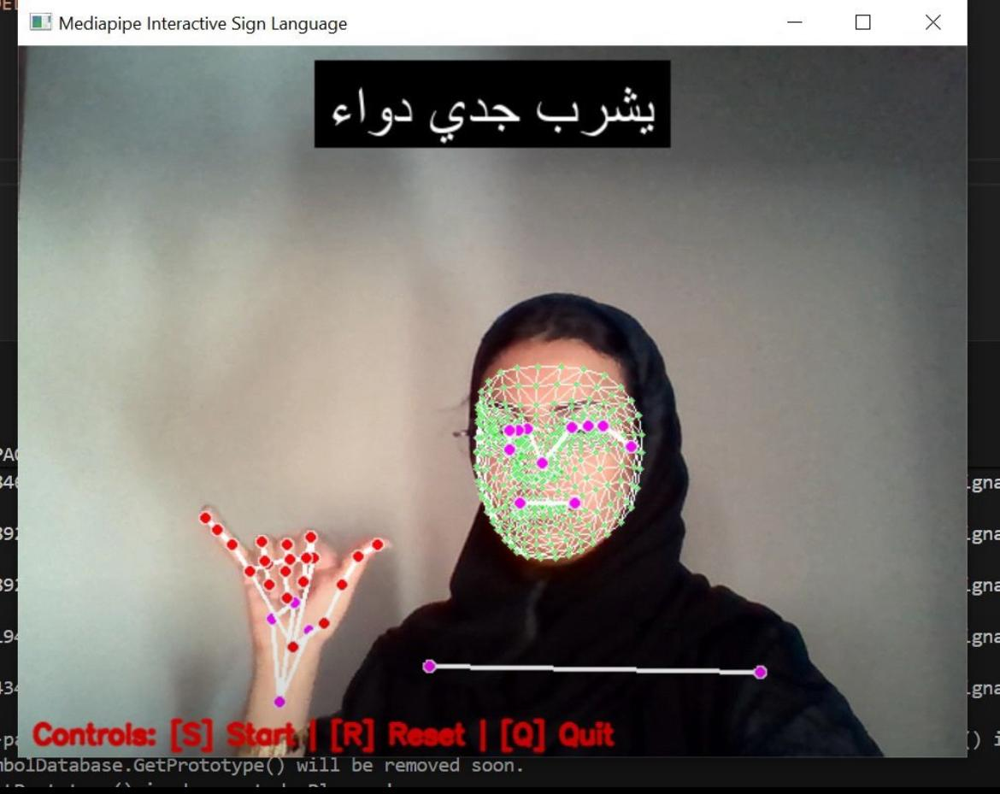

# UnMute-SignLanguage-AI
AI-powered Arabic Sign Language recognition system for inclusive communication and awareness.

---

# Un-Mute: Arabic Sign Language Recognition

> An AI-powered project that amplifies the voices of those who live in silence.  
> Un-Mute breaks stereotypes, celebrates talent, and promotes inclusion for the deaf community.

---

---

##  Project Vision

In a world full of sound, some live in silence—unseen and unheard.  
Un-Mute is a human-centered AI initiative that aims to:

- Shift societal perceptions of the deaf community  
- Highlight their talents and capabilities  
- Promote awareness and inclusion  
- Deliver interactive visual content that reflects their language and culture

---

##  Technical Overview

A deep learning model built with MobileNetV2 to classify Arabic sign language images into 36 distinct categories.

### Pipeline:
1. **Data Cleaning & Structuring**  
   - Remove duplicates  
   - Normalize folder names  
   - Balance image distribution

2. **Augmentation & Preprocessing**  
   - Smart image transformations  
   - Gaussian blur, rotation, brightness tuning  
   - Arabic reshaping and bidirectional text handling

3. **Exploratory Analysis**  
   - Visual distribution of images per class  
   - Insights before and after balancing

4. **Model Training**  
   - MobileNetV2 base with frozen layers  
   - Dense layers + Dropout  
   - EarlyStopping for optimal performance

5. **Evaluation & Visualization**  
   - Accuracy tracking across epochs  
   - Prediction vs. ground truth samples

6. **Text-to-Speech Integration**  
   - Converts Arabic predictions into spoken output using `gTTS` and `edge-tts`

---

## 📊 Dataset Summary

- Classes: 36 Arabic words  
- Images: ~23,000 preprocessed and balanced  
- Format: RGB, 224x224 resolution  
- Distribution: Uniform via custom augmentation

---

##  Model Performance

| Metric        | Value     |
|---------------|-----------|
| Training Accuracy | 83%+     |
| Validation Accuracy | 80%+     |
| Architecture  | MobileNetV2 |
| Loss Function | Sparse Categorical Crossentropy |
| Optimizer     | Adam      |

---

## 📁 Files

- `Unmute.ipynb`: Full notebook with preprocessing, training, and evaluation  
- `arabic_sign_model.h5`: Saved trained model  
- `class_names.json`: Class labels used in prediction  
- `samples/`: Example images for each class  
- `interface/Intro_Screen.jpg`: Project visual identity

---

##  Author

**Ibtisam Alghwainem**  
 CS Specialist & Cybersecurity| AI | Data Analyst | Visionary Technologist

- GitHub: [ibtisamalghwainem](https://github.com/ibtisamalghwainem)  
- LinkedIn: [ibtisamalghwainem](https://linkedin.com/in/ibtisamalghwainem)  
- Email: ibtisamalghwainem@gmail.com
